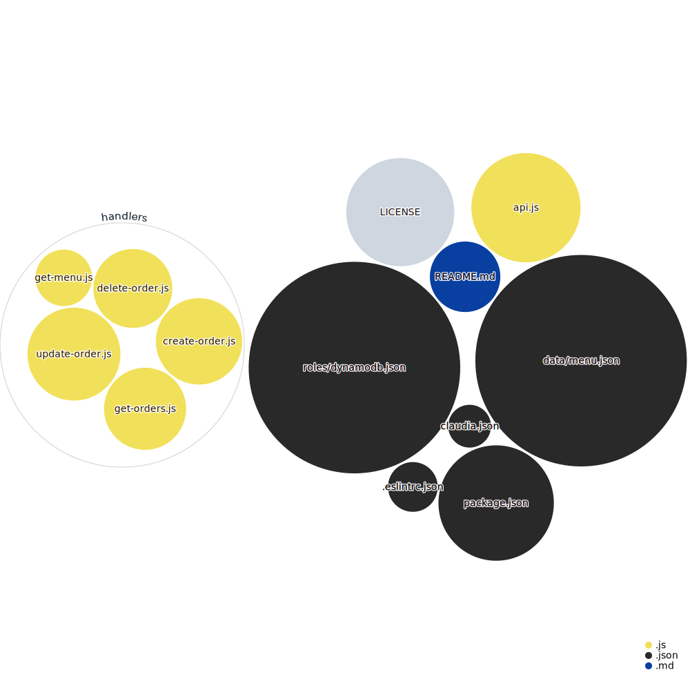

# Tofurkey 🦃

Using Claudia.js to create a serverless REST api for Tofurkey, a Christmas dinner order service.

The idea for this project came from ["Serverless Applications with Node.js"](https://www.manning.com/books/serverless-applications-with-node-js#toc) which served as a companion book.

---

## Repo diagram 📈

---

Made with 🫀 by Rolando Sotelo. Contact me at rola@hey.com

Be kind to animals 🐄 🐖 🐐!